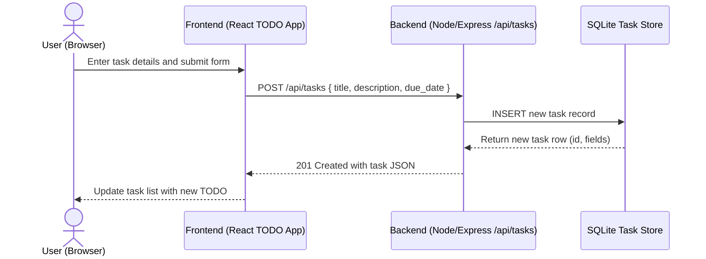

# Cloud Architecture Overview

This monorepo contains a React frontend and a Node/Express backend that exposes a task API backed by an in-memory SQLite database. The following context diagram shows the high-level components and their interactions.

```mermaid
graph TD
  U[End User (Browser)] --> FE[Frontend Web App (React)]
  FE --> API[Backend Service (Node/Express /api/tasks)]
  API --> DB[(SQLite Task Store)]

  subgraph Monorepo / Deployment
    FE
    API
    DB
  end
```

## Sequence: Creating a TODO

The following sequence diagram illustrates the main steps when a user creates a new TODO item.


